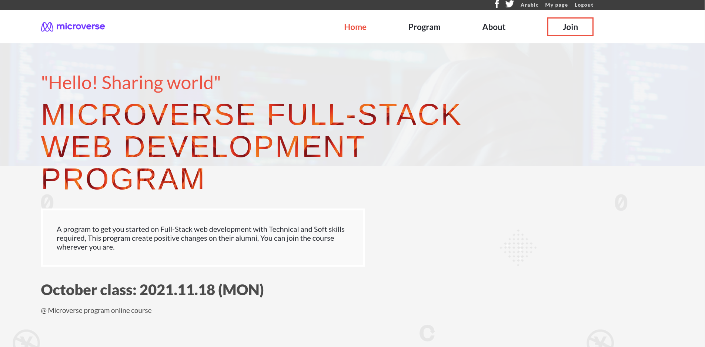

# Module 1 Capstone

> Microverse program

## Built With

- HTML & CSS

## Live Demo

[Portfolio Web Page](https://amrhub.github.io/Module1-Capstone-Web-development-course/)

## Getting Started

To get a local copy up and running follow these simple example steps.

### Setup

To setup the webpage in your local up in the repo page:
click on code (dropdown list) > Download as ZIP

### Deployment

To run the project open folder (after extraction) then run index.html

## Authors

👤 **Amr Ahmed**

- GitHub: [@Amrhub](https://github.com/Amrhub/)
- LinkedIn: [Amr Ahmed](https://www.linkedin.com/in/amr-ahmed-655420191/)

## 🤝 Contributing

Contributions, issues, and feature requests are welcome!

Feel free to check the [issues page](../../issues/).

## Show your support

Give a ⭐️ if you like this project!

## Acknowledgments
- Original design idea by <a href="https://www.behance.net/adagio07">Cindy Shin in Behance </a>.
- <a href="https://www.microverse.org/">Microverse</a> helped/guided me building this project.
- Icons made by <a href="https://www.flaticon.com/authors/smashicons" title="Smashicons">Smashicons</a> from <a href="https://www.flaticon.com/" title="Flaticon">www.flaticon.com</a>

## 📝 License

This project is [MIT](./MIT.md) licensed.
